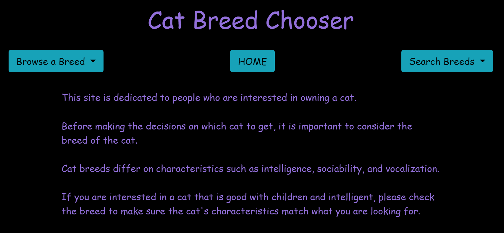
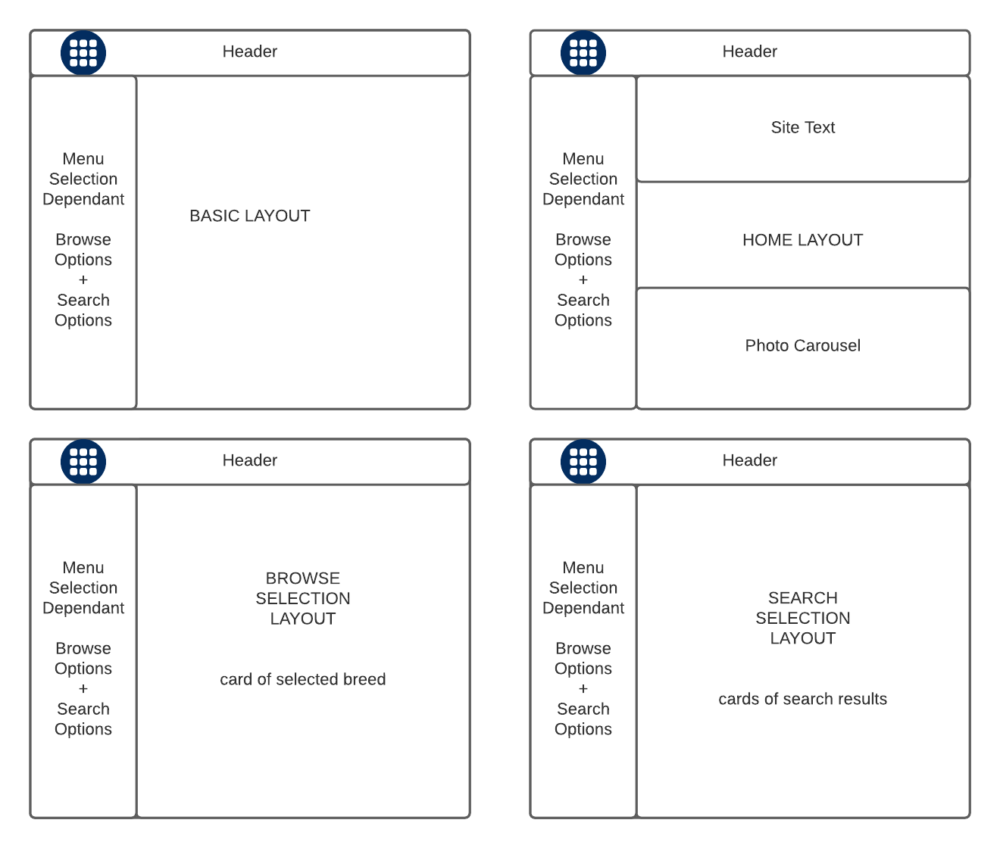
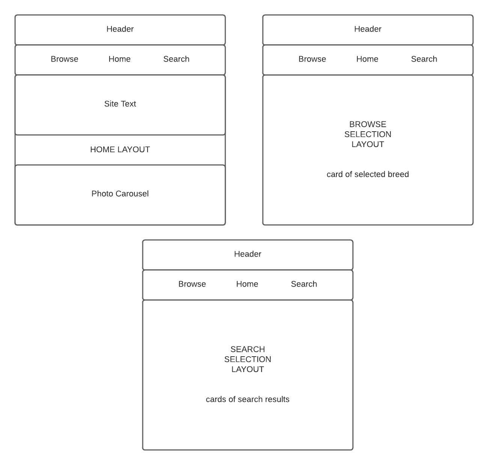

# Cat Breed Chooser



As the COVID-19 pandemic drags on and on, the familiar surroundings of home and hearth become - well - *_too_* familiar. After being trapped inside and not able to socialize because heath is valuable, a person must alter the familiar and implement new socialization strategies. The acquisition of a pet is a necessity. And that pet should be a cat.<br>

The pet options really boil down to choosing either a cat or a dog. A dog might be tempting, but dogs require outdoor exercise. Going outdoors means exposing your precious health to the disease-ridden, unwashed masses of unknown vaccination status. Cats do not require outdoor exercise and therefore do not require you to put your health at risk on a daily basis. Both a cat and a dog will provide a welcome change the familiar, but only a cat will allow you to stay safe and healthy inside your dwelling.<br>

The purpose of this project is to assist people with deciding which breed of cat would be best for them.
<br><br>

# Installation Instructions
If you would like install this project on your computer rather than use the online version hosted at https://cat-breed-chooser.herokuapp.com, you may clone this repository to your computer. (Also fee free to checkout the backend repository at https://github.com/richardcblewett/cat-breed-chooser-backend)<br>

After cloning the repository, make sure you have the dependencies installed before following the instructions on how to run the project. 

## Dependencies
- git (https://git.scm.com/downloads)
- node.js (https://nodejs.org/en/downloads)
- angular (https://angular.io/cli)

## Run the Project
- Open a command line / terminal
- Navigate to the cloned project directory. 
- Run the command: ```npm install``` (this will install node project dependencies)
- Run the command: ```ng serve --open``` (this will run and open the project in a web browser)
<br><br>

# Technologies Used
- Angular Cli
- Bootstrap
- Git
- Lucid.app (site design)
- Node.js
- Postman
- VS Code (IDE)
- WebStorm (IDE)
<br><br>

# Design

My original design for the side was to have a header with a navigation area on the left that dropped down into a left-side column.<br>

As I got further into the project I realized that while the original design would work great on a standard website, having a responsive mobile layout would be more difficult to implement.<br>

I pivoted to a simpler site that has essentially the same layout whether the user is on a traditional computer or a mobile device. <br>
## Site Wireframes
| Original | Final |   
| --- | --- |   
|  |  |   

## Bootstrap
I chose bootstrap as a CSS framework because I am interested in learning more about bootstrap and because it offers some built-in responsiveness. However, I also spiced the project with some vanilla CSS in places where I didn't want to use the default bootstrap options.<br>

## Searching
Rather than choose to search cat breeds one parameter at a time, I chose to search using one query that contained all parameters. I did this by using a form to fill out the query information, taking the time to make sure the form populates with data values.

<br><br>

# User Stories
All user stories assume the user is interested in getting a new cat and wants to do some initial research about the different breeds of cat available. 

## MVP 
-[x] As a user, I want to be able to browse the different breeds of cat so that I can do some research on breeds I know and find out if they will be a good choice for me.   
-[x] As a user who has children, I want to be able to search for cats that a good with children so I don't have to worry about cats and children not getting along.   
-[x] As a user who values intelligence, I want to be able to search for cat breeds that are at or above a certain intelligence threshold.   
-[x] As a user who likes clean animals, I want to be able to search cat breeds and exclude those breeds who are not up to my standards.

## Future Goals
- As a user, I want to be able to search for more cat breed characteristics. (Characteristics such as: )   
        - _The backend database has more data that could be accessed - it is a matter of finding the time to expand the frontend query form and update the backend to return more data._   
        - _There is always the option to return more data from the backend by default, but sending an entire database the frontend on a query defeats the purpose of having a backend._
- As a user, I want to be able to login to the site and keep track of the different cat breeds in which I am interested.   
        - _Most of the backend code to allow this is already in place, but needs to be implemented._  
        - _In order to correctly implement user accounts, I would want to use available authentication services such as Google Authenticator and other similar tools. I'd rather not track individual users personal information_    
- As a user, I want to be able to search in my local area for specific breeds of cat that are available to adopt.   
        - _Once user information is incorporated, this options may become a possibility. But it would be a ways down the road._    
- As a user, I want to receive alerts when a cat of a specific breed is available to adopt in my area.   
        - _Again, this would depend on having user and location area available. May be the equivalent of a pipe dream_

<br><br>


# Hurdles Overcome
1. As mentioned previously, the initial site design wasn't clean enough for my taste so I had to rearrange how things were displayed on the website.
1. I was not very familiar with bootstrap before I began this project. I was able to pick it up and understand what bootstrap is doing. I still have more to learn, but I feel I overcome my lack of familiarity with the framework.
1. I initially had an issue with receiving data when hitting endpoints. The issue turned out to be using two ".subscribe" methods in the same code. A resolution was achieved by making sure only one subscribe was called in the same method. If another subscribe was needed, the second one should be called in a separate method.    
    An quick example of code I was attempting to use one time is here:   

    ```
    ngOnInit(): void {
        this.searchPictures
        .subscribe( () => {
            this.picturesService.getAllPictures()
            .subscribe( response => {
                this.imageInput = response;
                console.log(this.imageInput[0])
            })
        })
    }
    ``` 
<br><br>

# Unresolved Issues
1. When clicking the "search" button and submitting a query, the query form gets hidden. But in order to show the form again there either needs to be another click on the page before clicking the "search breeds" button again or the user needs to click the "search breeds" button twice in order to see the form again.
1. More of an annoyance, but I would also like to be able to do some styling on the dropdown "search breeds" form... and so far I have been unable to find out how to do that. I feel I have complete control over everything on the webpage, and in this case I have not yet found a way to do so. 
1. The code assumes there will be at least one search result returned by the search query - and that has been the case so far. But the website should be able to handle gracefully those cases in which no result is returned.
<br><br>